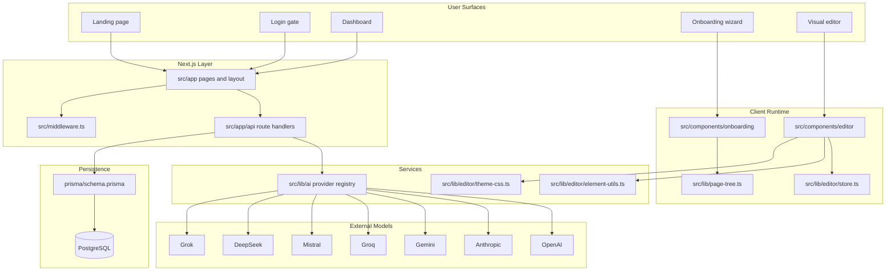
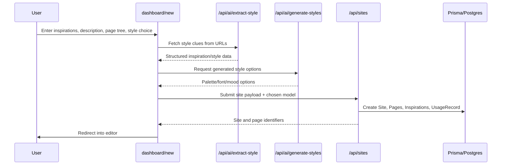
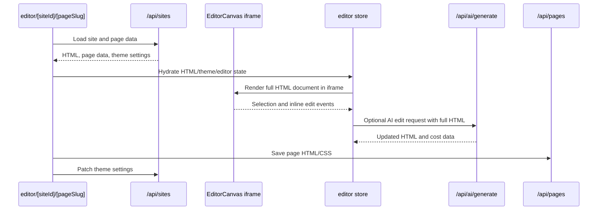

# EchoWebo Codebase Map

> Auto-generated by Cartographer. Last mapped: 2026-04-07T22:59:30Z

## System Overview

EchoWebo is a password-gated AI website builder built on Next.js 16 App Router. The product has five primary user surfaces: a marketing landing page, login gate, dashboard, onboarding wizard, and a visual editor that operates on stored full-page HTML documents.

The architecture is split between client-heavy route surfaces in `src/app`, a Prisma-backed persistence layer, and a pluggable AI provider registry that serves text generation, style generation, and image generation across onboarding and editing flows.



## Inventory

- 66 mapped source/config files
- 5 page routes
- 1 layout
- 7 route handlers
- 6 editor components
- 5 onboarding components
- 11 UI primitives/wrappers
- 7 AI provider implementations
- 9 Prisma models

## Directory Structure

```text
prisma/
  schema.prisma                # Site/page persistence, inspirations, usage, auth tables
src/
  app/
    layout.tsx                 # Root layout, fonts, toaster
    page.tsx                   # Landing page
    login/page.tsx             # Password gate
    dashboard/page.tsx         # Site listing
    dashboard/new/page.tsx     # Multi-step onboarding flow
    editor/[siteId]/[pageSlug]/page.tsx
                               # Visual editor shell and save flow
    api/
      ai/                      # Text edit, style extraction, style generation, image generation
      auth/login/route.ts      # Password cookie login
      pages/route.ts           # Page save/versioning
      sites/route.ts           # Site CRUD, theme updates, site generation
  components/
    editor/                    # Iframe editor, toolbar, AI prompt bar, photo/theme tools
    onboarding/                # Wizard steps and page-tree builder
    ui/                        # Base UI/shadcn wrappers plus ModelSelector
  lib/
    ai/                        # Provider registry and provider adapters
    editor/                    # Zustand store, DOM mutation helpers, theme CSS
    db.ts                      # Prisma singleton
    page-tree.ts               # Nested page-tree helpers
    utils.ts                   # cn helper
  types/
    index.ts                   # Shared contracts for editor, onboarding, AI, billing
.claude/
  launch.json                  # Local dev launch command
AGENTS.md                      # Agent-specific guidance
CLAUDE.md                      # Project overview and commands
README.md                      # Default create-next-app README, currently stale
```

## Module Guide

### App Router Surfaces

**Purpose**: Defines the user-facing screens and coordinates onboarding and editor flows.

**Entry points**:
- `src/app/page.tsx`
- `src/app/login/page.tsx`
- `src/app/dashboard/page.tsx`
- `src/app/dashboard/new/page.tsx`
- `src/app/editor/[siteId]/[pageSlug]/page.tsx`

| File | Purpose | Notes |
|------|---------|-------|
| `src/app/layout.tsx` | Root shell | Loads Geist fonts and Sonner toaster |
| `src/app/dashboard/new/page.tsx` | Onboarding orchestrator | Owns wizard step state, chosen models, submissions |
| `src/app/editor/[siteId]/[pageSlug]/page.tsx` | Editor route | Loads persisted HTML/theme, hydrates store, saves page/site |
| `src/app/dashboard/page.tsx` | Dashboard | Lists sites and routes into onboarding/editor |

**Dependencies**: Onboarding components, editor components, `src/lib/page-tree.ts`, `src/lib/editor/store.ts`, `src/lib/editor/theme-css.ts`.

**Dependents**: User navigation and all browser entry flows.

### API Routes

**Purpose**: Handles password login, site generation, page persistence, and AI-backed generation endpoints.

| File | Purpose | Notes |
|------|---------|-------|
| `src/app/api/sites/route.ts` | Site CRUD and generation | Largest route; creates demo-backed sites, builds pages, logs usage, patches themes |
| `src/app/api/pages/route.ts` | Page save/versioning | Stores HTML/CSS snapshots and creates versions |
| `src/app/api/ai/generate/route.ts` | AI HTML edits | Sends full page HTML plus optional selected element |
| `src/app/api/ai/generate-image/route.ts` | AI image generation | Returns generated image and cost data |
| `src/app/api/ai/generate-styles/route.ts` | Style option generation | Creates palette/font/mood suggestions |
| `src/app/api/ai/extract-style/route.ts` | Style scraping/extraction | Pulls style clues from user-supplied URLs |
| `src/app/api/auth/login/route.ts` | Password gate | Sets auth cookie for middleware |

**Dependencies**: Prisma client, `src/lib/ai/index.ts`, shared types, environment variables.

**Dependents**: Onboarding wizard, editor prompt bar, photo widget, editor save flow, dashboard loaders.

### Editor Runtime

**Purpose**: Provides iframe-based page editing over stored HTML documents.

| File | Purpose | Notes |
|------|---------|-------|
| `src/components/editor/EditorCanvas.tsx` | Iframe renderer | Injects DOM event bridge and posts selection/edit events back to React |
| `src/components/editor/FloatingToolbar.tsx` | Context actions | Maps current element type to edit/delete/duplicate/photo actions |
| `src/components/editor/AIPromptBar.tsx` | AI edits | Streams prompt-based HTML changes and tracks session spend |
| `src/components/editor/PhotoWidget.tsx` | Image insertion | Generates images and replaces selected images |
| `src/components/editor/ThemePanel.tsx` | Theme editing | Adjusts fonts and theme tokens |
| `src/lib/editor/store.ts` | Editor state | Tracks HTML, theme, selection, history, costs, modes |
| `src/lib/editor/element-utils.ts` | HTML mutation helpers | Uses `DOMParser` to mutate selected elements |
| `src/lib/editor/theme-css.ts` | Theme CSS generation | Defines defaults and serializes theme state into CSS |

**Patterns**:
- Whole-document history snapshots for undo/redo
- Selection keyed by generated CSS-like element paths
- Full HTML document rendering inside a sandboxed iframe

### Onboarding Flow

**Purpose**: Collects inspiration, business metadata, a page tree, and preferred style before generating a site.

| File | Purpose | Notes |
|------|---------|-------|
| `src/components/onboarding/InspirationStep.tsx` | URL inspiration intake | Calls style extraction endpoint |
| `src/components/onboarding/DescriptionStep.tsx` | Business metadata | Collects company and site description fields |
| `src/components/onboarding/PageTreeBuilder.tsx` | Page structure editor | Uses `dnd-kit` and page-tree helpers for nested navigation |
| `src/components/onboarding/StylePreview.tsx` | Style option review | Displays generated style cards |
| `src/components/onboarding/GeneratingView.tsx` | Progress UI | Simulated generation feedback |
| `src/lib/page-tree.ts` | Tree utilities | Slugging, flattening, drag/drop moves, depth limits |

**Key behavior**:
- Nested page trees only exist during onboarding
- Submission payload is flattened before it reaches persistence
- Chosen text model flows from the UI into site generation and later editor prompts

### AI Provider Layer

**Purpose**: Abstracts model access behind provider registration and shared text/image APIs.

**Registry**:
- `src/lib/ai/provider.ts`
- `src/lib/ai/index.ts`

**Provider files**:
- `src/lib/ai/openai.ts`
- `src/lib/ai/anthropic.ts`
- `src/lib/ai/gemini.ts`
- `src/lib/ai/groq.ts`
- `src/lib/ai/mistral.ts`
- `src/lib/ai/deepseek.ts`
- `src/lib/ai/grok.ts`

**Pattern**:
- Each provider registers itself on import
- Route handlers dynamically import the registry entrypoint
- Frontend model catalogs in `src/components/ui/ModelSelector.tsx` must stay in sync with backend model availability

### Data and Shared Contracts

**Purpose**: Stores generated sites/pages and defines the shape of onboarding, editor, AI, and billing state.

| File | Purpose | Notes |
|------|---------|-------|
| `prisma/schema.prisma` | Persistence schema | 9 models including `Site`, `Page`, `PageVersion`, `SiteInspiration`, `UsageRecord` |
| `src/lib/db.ts` | Prisma singleton | Standard cached Prisma client setup |
| `src/types/index.ts` | Shared contracts | Central contract file for page trees, editor state, AI models, theme settings |

**Model focus**:
- `Site` stores site metadata and theme settings
- `Page` stores current page HTML and associated metadata
- `PageVersion` preserves save history
- `SiteInspiration` stores URL/style references
- `UsageRecord` tracks AI spend/activity

## Data Flow

### Onboarding to Site Generation



### Editor Load, Edit, and Save



## Conventions

- Middleware-based auth: `src/middleware.ts` guards most routes behind a password cookie set by `src/app/api/auth/login/route.ts`.
- Client-first UX: onboarding and editor logic mostly live in client components and route pages instead of server actions.
- Route handler structure: App Router `route.ts` files own persistence and AI calls directly.
- Provider registry: new AI backends plug in through registration side effects rather than switch statements.
- Whole-document editing: the editor mutates serialized HTML documents, not React component trees.
- Theme persistence: theme settings are stored separately from page HTML and regenerated into CSS for the editor.

## Gotchas

- `src/components/onboarding/StylePreview.tsx` wires "Regenerate" to the parent `handleNext()`, which advances into site creation instead of re-calling style generation.
- `src/app/api/sites/route.ts` is both the main CRUD endpoint and the site-generation pipeline, so it concentrates many responsibilities and assumptions.
- Ownership is weakly enforced: middleware only checks a password cookie, while site/page API routes operate over broadly accessible records.
- Nested onboarding page structure is flattened before persistence, so parent-child hierarchy does not survive as a first-class database relation.
- `page.css` is loaded in the editor route, but saves overwrite CSS from `generateThemeCss(theme)`, so separate page CSS has limited effect.
- The editor iframe runs stored/generated HTML with `allow-scripts allow-same-origin`, so external scripts in saved pages execute during editing.
- `src/app/api/ai/extract-style/route.ts` fetches arbitrary user-provided URLs, which is an SSRF boundary to keep in mind.
- `README.md` still describes the default create-next-app starter and should not be treated as current architecture documentation.

## Navigation Guide

**To add a new AI provider**
- Update `src/lib/ai/<provider>.ts`
- Import it from `src/lib/ai/index.ts`
- Adjust shared registry behavior in `src/lib/ai/provider.ts` if needed
- Add visible model options to `src/components/ui/ModelSelector.tsx`

**To change editor selection or toolbar behavior**
- Update iframe event logic in `src/components/editor/EditorCanvas.tsx`
- Update action rendering in `src/components/editor/FloatingToolbar.tsx`
- Update DOM mutation helpers in `src/lib/editor/element-utils.ts`
- Update state/history fields in `src/lib/editor/store.ts`

**To add onboarding fields**
- Extend state and submission handling in `src/app/dashboard/new/page.tsx`
- Update the relevant component under `src/components/onboarding/`
- Extend shared contracts in `src/types/index.ts`
- Thread new values into `src/app/api/sites/route.ts` or `src/app/api/ai/generate-styles/route.ts`

**To change page/site persistence**
- Start at `prisma/schema.prisma`
- Update `src/app/api/sites/route.ts` and `src/app/api/pages/route.ts`
- Adjust tree flattening in `src/lib/page-tree.ts` if structure changes
- Sync loader/save behavior in `src/app/editor/[siteId]/[pageSlug]/page.tsx`

**To add a new API route**
- Create `src/app/api/<segment>/route.ts`
- Reuse `src/lib/db.ts` for database access or `@/lib/ai` for model access
- Add shared request/response types in `src/types/index.ts` when the route becomes part of app contracts
- Update `src/middleware.ts` only if the route should bypass the password gate
